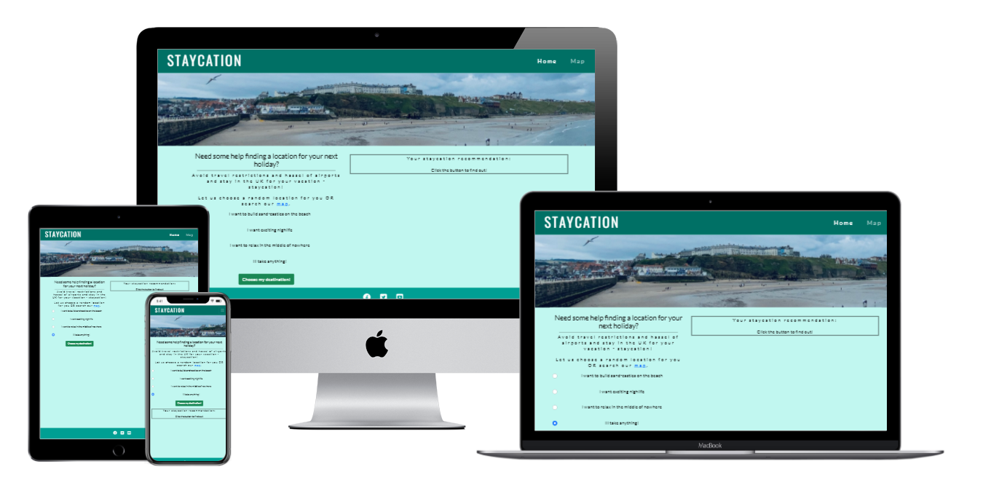
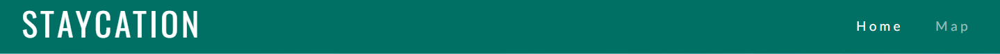
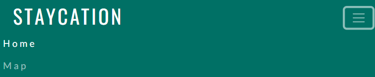
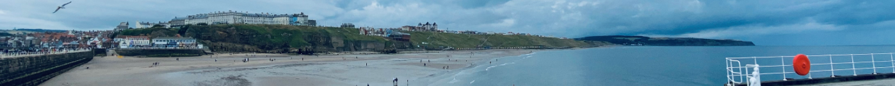
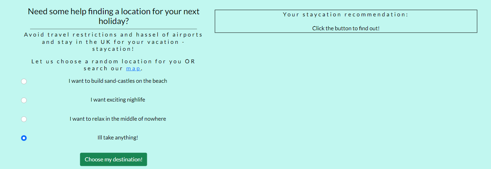
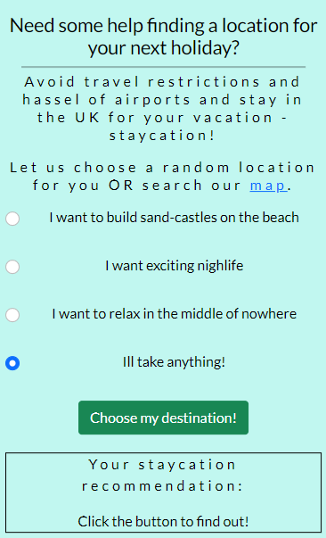
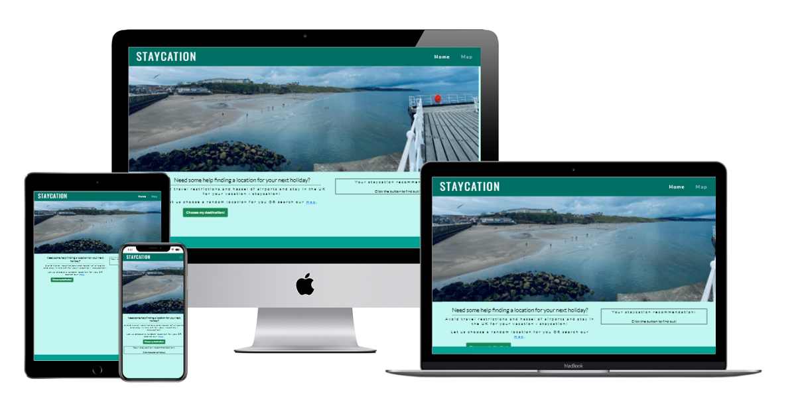

# STAYCATION

This site is targeted at people in the UK that are unable to or avoiding travel abroad and looking to remain in the UK to holiday. It offers different methods for users to find a location within the UK to holiday that they would have otherwise not considered as a holiday destination.  

## User experience design

### Strategy
* Defining the goals - From both national news and after speaking with friends and family about thier current needs and things that may be missing from their lives, i soon established a commom theme. Since the last Covid-19 lockdown and with travel restrictions abraod still in place, along with the additional costing of PCR testing on top of holidays abroad it was relatable that people in the UK were now choosing to holiday within the UK. The idea of staycationing has become hugley popular this year within the UK. 
* what is the idea? From this research i narrowed down my idea to having a site that could aid with choosing a location to holiday within the UK. I followed up with the same focus group and found that many people were un aware of all of the amazing locations within the UK but were willing to travel across the UK to find them.
* who is the target audience? From this i came up with a target audience of all people in the UK that were looking for a staycation location.. 
* why should it be created? Offering something that could potentially offer inspiration of a location to holiday within the UK could hugely benefit the user.

### Scope
* features and functions - several different way to seach for a location, including a random generator for those with no restrictiong criteria.
* content requirements - simple but effective. 

#### User stories
* Objective - what does the user want to accomplish? 
    * To be able to see potential locations across the UK to holiday.
* Functional - what does the user need to do to accomplish the objective? whats involved?
    * Simply visit the site. No effort involved. Minimal clicks to get to content. 
    * No sign in or form filling if user chooses not to.
* Non-functional - what contraints does the site have to perform in?
    * It is limited to HTML, CSS and JavaScript so functionality will be basic. 

### Structure
* how will content be organised and presented - site map
    * 2 page design - homepage and map page

### Skeleton

### Surface
* Following the C.R.A.P (consistancy, repetition, alignment and proximity) design methodology the pages will all have the same nav bar, footer and color scheme. This will help create a positive user experience. 

## Features

### Home page

* Navigation bar

    * Featured on both pages, the full responsive bar includes Logo (links to homepage), home page and map page and is identical in each page to allow for easy navigation.
    * This section will allow the user to easily navigate between pages without having to revert back to the previous page via the browsers back button.
    * The navigation bar uses a collapsed 'hamburger' style for the link on mobile devices and smaller screen sizes. 

* Header top (home page main image)

    * The home page main image is a photograph of a typical UK beach which immediatly gives the context of the site.

* Header bottom

    * The header bottom provides details on how a user can get involved with the site with a link directing them to the map page and a button to randomly generate a location to staycation.
    * The header bottom is responsive to screen size and will adjust accordingly by having the location output side by side with the text on a larger screen size. On a smaller screen size the location output will appear below the text.

* Footer

    * The footer section is repeated across all pages for consistancy so the user can become comfortable with the layout no matter which page they are on.
    * The footer contains links to social media accounts that open in new windows so that they can easily go back to the page they were on.

### Map page

* The map page is where users can select a location from the markers on the map. This would be of benefit of the user already has a rough idea of area they wish to vist but would like to know specific locations within the area.
* The map page is responsive to screen size and will adjust accordingly by having the location output side by side with the map on a larger screen size. On a smaller screen size the location output will appear below the map. 

## Testing

* [material.io]('https://material.io/resources/color/#!/?view.left=1&view.right=1&primary.color=557a95&secondary.color=33691E']) was used to check accessibility of text colours on background colours. Also used to find complemetary colours. This is where i decided on my 2 shades of blue with white text. As the result was that black was not legible on these shades of blue. Credit to my mentor Akshat for showing me this resource. 

* [Chrome developer tools](https://developer.chrome.com/docs/devtools/) on the browser was used to see any errors on the pages.

* [Chrome developer tools](https://developer.chrome.com/docs/devtools/) device toggle toolbar was utilised to view the site via emulators of different screen sizes. This is when i noticed that the form on the contact page looked good on the mobile view but was taking up too much width on a large screen size so i put in a media query for larger screen sizes only to reduce the width of the contact form.

* Chrome Lighthouse audit (Chrome -> dev tolls -> Lighthouse) was run to for performance, accessibility, SEO and best practices.

* Jshint

### User Acceptance Testing

The UAT was carried out on desktop, tablet and mobile screen sizes. The UAT was also caaried out on Chrome, firefox and Edge. This was to ensure cross broswer and cross device compatability and to acieve a positive user experience. 

#### Home page

Test | Expected Outcome | Actual outcome|status
-----|------------------|----------------|--------
Images|All images appear, sized correctly with alt tags|Hero image, circle image and font awesome social media images all loaded correctly| Pass
fonts|fonts use specified google fonts| Oswald and Lanto fonts load|Pass
Nav bar|responsive navbar with varying screen sizes| Nav bar is full width with visable logo text and page links on desktop and tablet screen. On mobile screen sizes it is full width with a collapsed 'hamburger' toggle hiding the page links until pressed.|Pass 
links|internal link to remain in current window and external links to open in new tab| Social media images in footer all open associated sites in a new tab. 'Send details' button opens internal link in same window to contact page.|Pass
Header bottom|responsive layout| text and circular image side by side on desktop and tablet screen sizes. Circular image below text on mobile screen sizes.|Pass 

#### Map

Test | Expected Outcome | Actual outcome|status
-----|------------------|----------------|--------
Images|All images appear, sized correctly with alt tags|All card images of individual dogs appear, the correct size with the correct alt tages|Pass
Nav bar|responsive navbar with varying screen sizes| Nav bar is full width with visable logo text and page links on desktop and tablet screen. On mobile screen sizes it is full width with a collapsed 'hamburger' toggle hiding the page links until pressed.|Pass 
links|internal link to remain in current window and external links to open in new tab| Social media images in footer all open associated sites in a new tab. 'Enter' button opens internal link in same window to contact page.|Pass
Cards|responsive columns|columns of 4 cards on desktop and tablet screens and 1 column on mobile screens |Pass

### Validator testing

* HTML using [W3C validator](https://validator.w3.org/nu/?doc=https%3A%2F%2Fsclarkstone.github.io%2FmilestoneProject1%2F) - index.html

    * 'Warning: Attribute title is not serializable as XML 1.0.' - on reviewing the code there was a missing closing tag for the custom style sheet on the line before the title tag. I corrected this by adding the closing tag '/>', re run through validator and error was resolved. I applied this to each page.

    * 'Error: End tag nav seen, but there were open elements.' - on looking at the code i had a div that was opened inside of the nav but closed outside it. so i moved the closing div inside of the nav. re run through validator and the error was resolved.  I applied this to each page.

    * 'Error: Stray start tag script'. after looking at my code i noticed that the script tag was outside of the body tag. I moved the script tag to be inside the body closing tag but remaining at the bottom of the page. re run the validator and the error was resolved.  I applied this to each page.

    * After correcting the above errors and re running the w3c validator the following message came 'Document checking completed. No errors or warnings to show'.

* HTML using W3C validator - gallery.html

    * 'Error: Stray end tag head.' on looking at the code i could see a duplicate closing head tag. i removed the duplicate. re run the validator and the error was resolved. 

    * 'Error: Duplicate ID card.' after looking at the code i noticed that the style used for each photo in the gallery was using the same id for each instead of having the same name as the class. ameneded the id to be class name and amended the style class to reflect this too. re run validator and this resolved the error. 

    * After correcting the above errors and re running the w3c validator the following message came 'Document checking completed. No errors or warnings to show'.

* HTML using W3C validator - contact.html 

    * 'Error: Duplicate ID contact.' - after looking at the code i could see that i was using the same id name for both the section and container div. i removed the unused id on the container div. re run the validator and this resolved the error.

    * 'Error: Bad value for attribute action on element form: Must be non-empty.' - after looking at the code i saw that the action in the form tag was empty.  i removed the action form the form. re run the validator and this resolved the error.

    * After correcting the above errors and re running the w3c validator the following message came 'Document checking completed. No errors or warnings to show'.

* CSS

    * No errors were found when passing through the offical [(Jigsaw) validator](https://jigsaw.w3.org/css-validator/validator?uri=https%3A%2F%2Fsclarkstone.github.io%2FmilestoneProject1%2Fassets%2Fcss%2Fstyles.css&profile=css3svg&usermedium=all&warning=1&vextwarning=&lang=en) for my custom style.css. however, 17 errors were found in the bootstrap cdn. 

### First mentor review
After the first review with my mentor some recommendations for improvements were made, they are detailed below. I Have also included a mockup screen shot image of before the mentor recommendations were made to give some context as to why the recomendations were made and to show the improvements that were made by implementing them.

* Homepage
   * Need significantly more information about the randomly selected city. To achieve this, the layout will need to be ameded to make more room for the city information box. The hero image will need to be reduced in height on all devices screen sizes and on larger screen sizes the left column will need to be wider and the right column size reduced. Suggestions for more information are weather (using the open weather map api), AirBnB link, trip advisor link, bus and trains schedules. Advice was to ensure there is a balance of both travel and activities about the location.  

* Map
    * Need significantly more information about the randomly selected city.Suggestions for more information are weather (using the open weather map api), AirBnB link, trip advisor link, bus and trains schedules. Advice was to ensure there is a balance of both travel and activities about the location. 
  

### Second mentor review
After the second review with my mentor some recommendations for improvements were made. I carried out these recommendations, they are detailed below.

* Homepage
    

* Map
   

### Bugs

* The bootstrap toggler menu was not expanding on mobile view. No errors were being given in the console. I fixed this by comparing my code to my previous milestone project and realised that i had missed the CDN link for the bootstrap js file after the fotter on my pages. Once added the menu then functioned as expected.

## Desirable features
This site for the purpose of this milestone project is a Minimum Viable Product (MVP) and contains essential features that allow it to function. Possible deseriable features for future development include;

* Notifications - users can sign up to receive noticifications of content updates. This would utilise the users preferred contact method. 
* user profiles - a log in area for users to maintain profiles including preferred contact mehtod and notification frequency.

These development ideas would require the static site to utilise a backend database to store and call upon user information. 

## Deployment

The site was deployed to GitHub pages. The steps to deploy are as follows:

* In the GitHub repository, navigate to the Settings tab
* Select Pages on left side menu
* Select the Master Branch
* Click save
* The page will be automatically refreshed with a detailed ribbon display to indicate the successful deployment.

The live link can be found here - [site link](https://sclarkstone.github.io/milestoneProject1/)

## Credits

### Layout
* github - code institute/gitpod-full-template

* [bootstrap V5](https://getbootstrap.com/docs/5.0/getting-started/introduction/)

    * nabar
    * grid layout with rows and columns
    * form controls
    
* [Code institute](https://learn.codeinstitute.net/) course material. Specially the 'Love Running' tutorial gave me the inspiration and guidance for the layout of this site.

### Content

* The icons in the footer were taken from [Font awesome](https://fontawesome.com/)

* [google fonts](https://fonts.google.com/) was used to give the project a more professional and unique feel. Google fonts gave fonts that go together and as i had already seen the Lanto font in use on the Code institute 'love running' project and felt it fit in well with my project i went with Lant and Oswald. 

* [material.io]('https://material.io/resources/color/#!/?view.left=1&view.right=1&primary.color=557a95&secondary.color=33691E']) was used to check accessibility of text colours on background colours. Also used to find complemetary colours. This is where i decided on my 2 shades of blue with white text. As the result was that black was not legible on these shades of blue. Credit to my mentor Akshat for showing me this resource. 

* OpenWeatherMap API. Credit to the provdided walkthroughs at [Fetch the Weather with OpenWeatherMap API and JavaScript]('https://bithacker.dev/fetch-weather-openweathermap-api-javascript') and [openweathermap]('https://openweathermap.org/current') for how to display the API JSON as desired.  

### Media

* The photo of the beach was taken by me in Whitby Aug 2021. 
